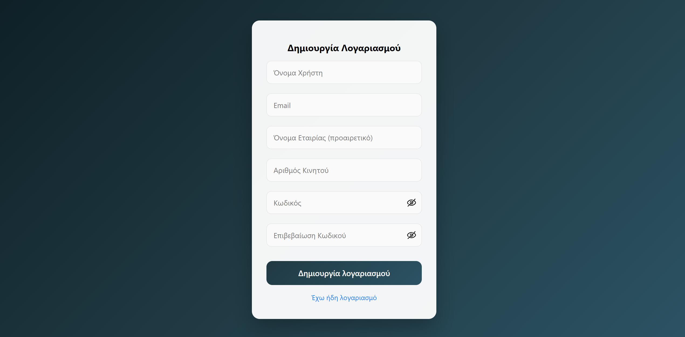
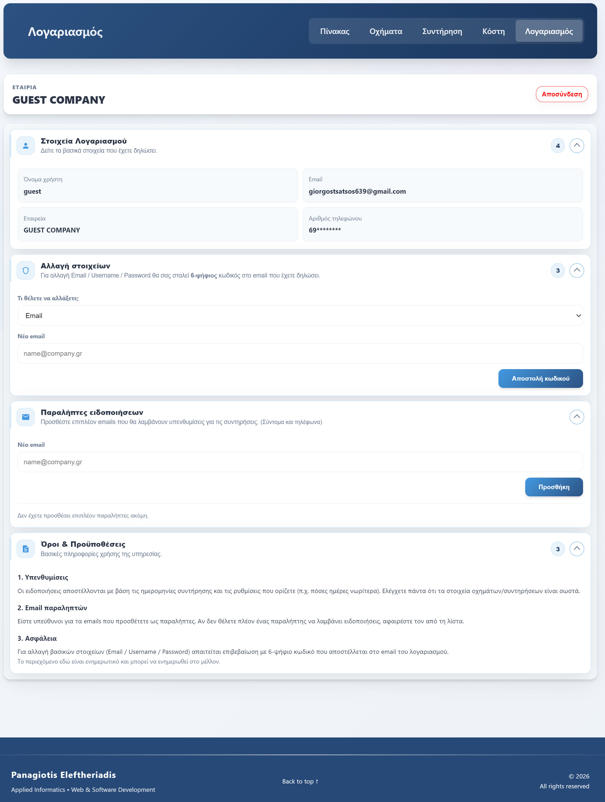
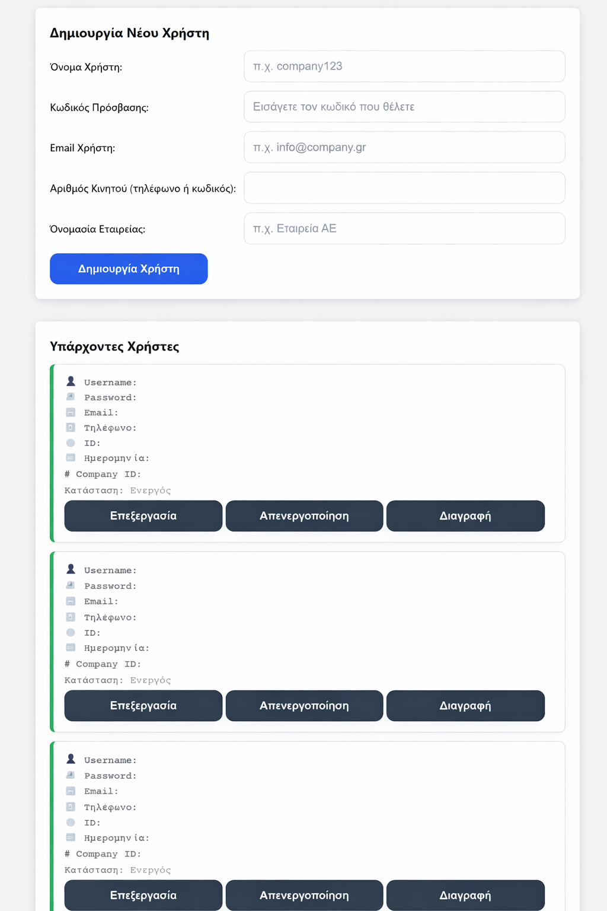

# 🚗 CaReMind – Vehicle Maintenance & Cost Management System


---

## 📌 Project Overview

**CaReMind** is a full-stack web application designed to help users manage their vehicles, track expenses, schedule maintenance, and receive automated notifications and email reminders.

The system follows a **Client–Server architecture** with a dedicated frontend and backend, connected via a secure **RESTful API** and powered by a **MySQL database**.

---

## 🎯 Key Features

* User Authentication (Register / Login)
* Vehicle Management (CRUD operations)
* Maintenance Scheduling
* Cost & Expense Tracking
* Notification System
* Automated Email Reminders (Resend API)
* Admin Panel (User Management)
* REST API
* Secure JWT Authorization
* Cron Jobs for automation

---

## 🧰 Tech Stack

### Frontend

* **HTML5**
* **CSS3**
* **Vanilla JavaScript**
* Responsive UI
* Fetch API for server communication
* Modular JS structure

### Backend

* **Node.js**
* **Express.js**
* RESTful API Architecture
* JWT Authentication
* Middleware for route protection
* Cron Jobs for scheduled tasks

### Database

* **MySQL**
* Relational schema
* Structured tables for:

  * Users
  * Vehicles
  * Costs
  * Maintenances
  * Notifications

### Email Service

* **Resend API**
* Automated email notifications
* Secure API key handling via environment variables

---

## 🗂️ Project Structure

```
CaReMind/
│
├── backend/
│   ├── server.js
│   ├── db.js
│   ├── middleware.js
│   ├── emailService.js
│   ├── routes/
│   │   ├── auth.js
│   │   ├── account.js
│   │   ├── vehicles.js
│   │   ├── costs.js
│   │   ├── maintenances.js
│   │   ├── notifications.js
│   │   ├── adminUsers.js
│   │   ├── cron.js
│   │   ├── interest.js
│   └── sql/
│
├── frontend/
│   ├── pages/
│   ├── css/
│   ├── js/
│   ├── api.js
│   ├── auth.js
│   ├── auth-guard.js
│
├── screenshots/
│   ├── login.png
│   ├── register.png
│   ├── dashboard.png
│   ├── vehicles.png
│   ├── costs.png
│   ├── maintenances.png
│   ├── notifications.png
│   ├── account.png
│   ├── admin.png
│
├── package.json
└── README.md
```

---

## 📸 Application Screenshots

### 🔐 Login Page


### 📝 Register Page



### 📊 Dashboard


### 🚗 Vehicles Management


### 💰 Costs Management


### 🛠 Maintenance Scheduling


### 🔔 Notifications


### 👤 Account Settings



### 🧑‍💼 Admin Panel



---

## 🌐 REST API Documentation

| Method | Endpoint          | Description           | Auth Required |
| ------ | ----------------- | --------------------- | ------------- |
| POST   | /auth/register    | Register new user     | ❌             |
| POST   | /auth/login       | Login user            | ❌             |
| GET    | /vehicles         | Get all vehicles      | ✅             |
| POST   | /vehicles         | Create new vehicle    | ✅             |
| PUT    | /vehicles/:id     | Update vehicle        | ✅             |
| DELETE | /vehicles/:id     | Delete vehicle        | ✅             |
| GET    | /costs            | Get all costs         | ✅             |
| POST   | /costs            | Create cost entry     | ✅             |
| DELETE | /costs/:id        | Delete cost entry     | ✅             |
| GET    | /maintenances     | Get all maintenances  | ✅             |
| POST   | /maintenances     | Create maintenance    | ✅             |
| DELETE | /maintenances/:id | Delete maintenance    | ✅             |
| GET    | /notifications    | Get notifications     | ✅             |
| POST   | /notifications    | Create notification   | ✅             |
| GET    | /account          | Get account info      | ✅             |
| PUT    | /account          | Update account info   | ✅             |
| GET    | /adminUsers       | Admin user management | ✅ (Admin)     |

---

## ⏰ Automation & Cron Jobs

The system uses scheduled background jobs to:

* Check upcoming maintenance dates
* Generate notifications
* Send reminder emails

File:

```
routes/cron.js
```

---

## 📧 Email Notifications (Resend API)

Email functionality is implemented using the **Resend API** for:

* Maintenance reminders
* System notifications
* Automated alerts

Configured via environment variables and handled in:

```
emailService.js
```

---

## 🔐 Security

* JWT Authentication
* Protected API routes
* Environment variables (.env)
* Role-based authorization (User / Admin)

---

## ⚙️ Environment Variables (.env)

Example configuration:

```
DB_HOST=localhost
DB_USER=root
DB_PASSWORD=your_password
DB_NAME=caremind
JWT_SECRET=your_secret_key
RESEND_API_KEY=your_resend_api_key
PORT=3000
```

---

## ▶️ Installation & Running the Project

### 1️⃣ Backend Setup

```bash
cd backend
npm install
node server.js
```

### 2️⃣ Database Setup

* Import SQL files from `/backend/sql`
* Create database `caremind`
* Configure `.env` file

### 3️⃣ Frontend

Open HTML files using a browser or Live Server extension.

---

## 🏗️ Architecture

```
Frontend (HTML / CSS / JS)
        ↓ Fetch API
Backend (Node.js + Express REST API)
        ↓
MySQL Database
        ↓
Resend Email API
```

---

## 📊 System Capabilities

* Full CRUD functionality
* Real-time user data management
* Automated scheduled tasks
* Secure authentication
* Modular scalable architecture

---

## 🚀 Future Improvements

* Mobile application
* Cloud deployment
* Push notifications
* Analytics dashboard
* Multi-language support

---

## 👨‍💻 Author

Developed as a full-stack web application project using modern web technologies.

---

## 📄 License

This project is for educational and demonstration purposes.

---

⭐ If you like this project, feel free to star the repository!
