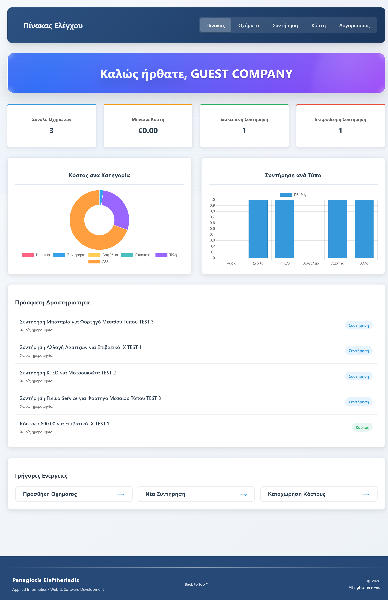
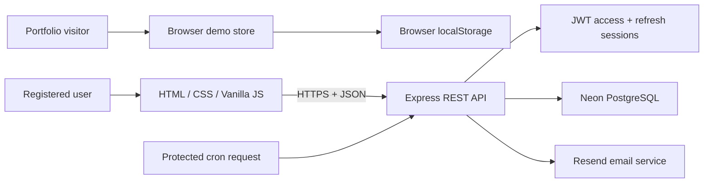
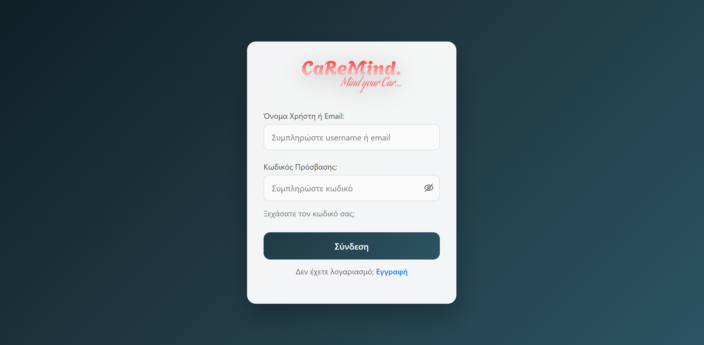
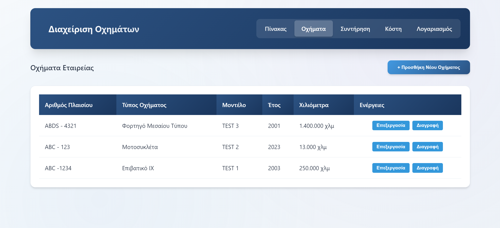
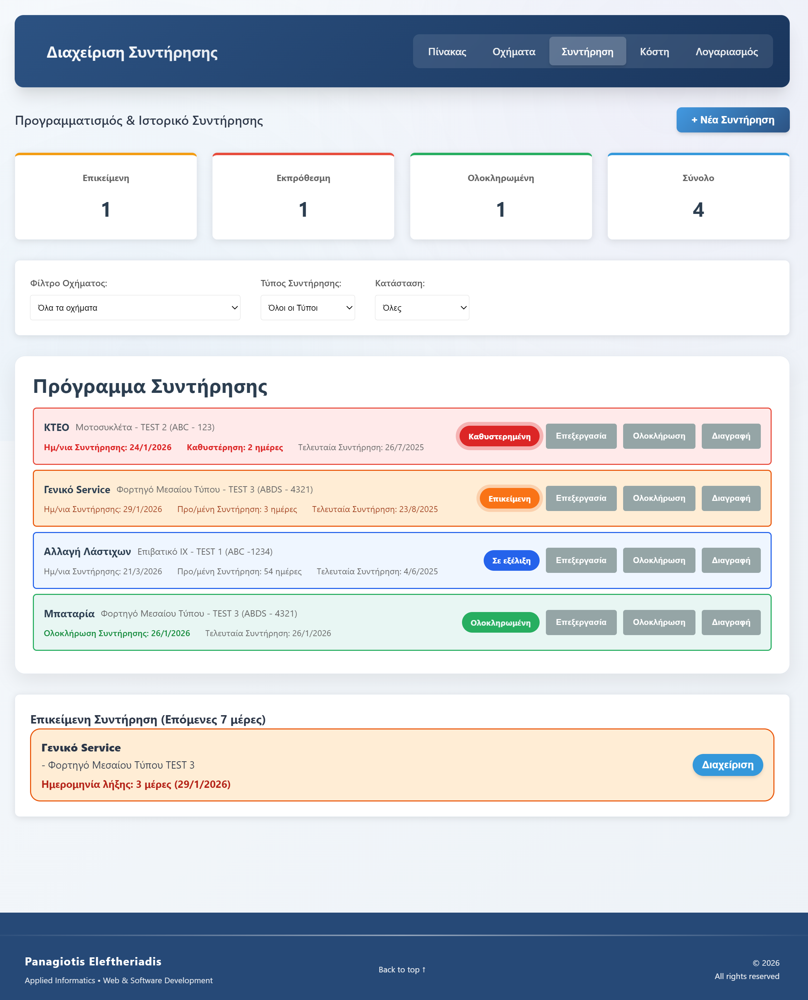
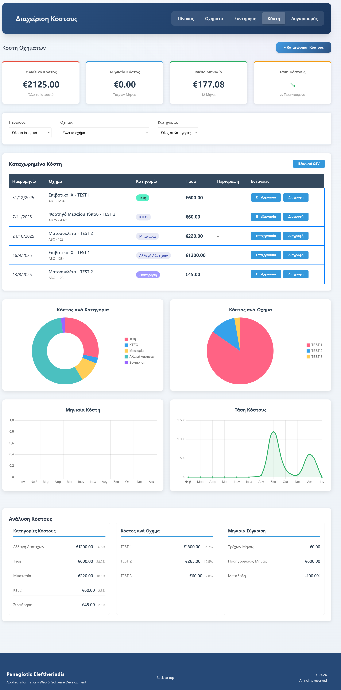

# CaReMind

Vehicle maintenance and operating-cost management for individuals and small fleets.

[**Open the live demo**](https://car-remind.gr) · No registration or backend connection required



## What the project does

CaReMind gives each account a private workspace for its own vehicles. Users can register vehicles, schedule and complete maintenance, track costs, review upcoming reminders and manage notification recipients.

Version 1 deliberately uses one owner per fleet: all vehicle, maintenance and cost records are scoped by `user_id`. `companyName` is profile information, not a shared organisation or team boundary. Invitations and multi-user companies are intentionally deferred to a future version.

The portfolio demo runs entirely in the browser. It loads realistic seed data into `localStorage`, implements the same API-shaped operations used by the real interface and can be reset at any time. Demo data never reaches the production backend.

## Highlights

- Browser-only portfolio demo with complete CRUD flows
- Access and refresh-token authentication with email verification
- Ownership checks for every vehicle, maintenance and cost mutation
- Expense summaries, charts, filters and CSV export
- Maintenance reminders and configurable email recipients
- Responsive vanilla JavaScript interface with accessible dialogs and feedback
- Non-destructive, checksum-protected PostgreSQL migrations
- Automated API, authorization and demo-flow tests in GitHub Actions

## Architecture



The frontend calls one API adapter. When demo mode is enabled, that adapter delegates to `demo-store.js`; otherwise it calls the Express API. This keeps the visible user flows consistent without requiring paid infrastructure for recruiter access.

## Technology

| Layer | Technology |
| --- | --- |
| Frontend | HTML5, CSS3, Vanilla JavaScript, Chart.js |
| Backend | Node.js 22, Express 5 on Vercel Functions |
| Database | Neon PostgreSQL, custom ordered migrations |
| Security | bcrypt, JWT, HttpOnly cookies, Helmet, rate limiting |
| Email | Resend |
| Quality | Node test runner, GitHub Actions, npm audit |

## Screens

| Login and demo entry | Vehicles |
| --- | --- |
|  |  |

| Maintenance | Costs |
| --- | --- |
|  |  |

Additional screens: [registration](screenshots/register.png), [account](screenshots/account.png) and [admin](screenshots/admin.png).

## Run locally

Requirements: Node.js 22+, npm and PostgreSQL 17+ (or a Neon project).

```bash
git clone https://github.com/panagiotiseleftheriadis/CaReMind.git
cd CaReMind/backend
npm ci
copy .env.example .env
npm run db:setup
npm start
```

On macOS/Linux, use `cp .env.example .env`. Set `DATABASE_URL` in `.env` before running the migration. `npm run db:setup` applies every pending migration without dropping existing tables or data.

Serve `frontend/` with any static server, for example VS Code Live Server. The deployed frontend automatically uses `https://api.car-remind.gr/api`; localhost uses `http://localhost:3000/api`.

### Optional development administrator

There is no default password or plaintext seed account. To create or update a local administrator, configure these development-only variables and run the separate seed command:

```dotenv
DEV_ADMIN_USERNAME=local-admin
DEV_ADMIN_EMAIL=admin@example.test
DEV_ADMIN_PASSWORD=use-a-strong-local-password
```

```bash
npm run db:seed
```

The seed refuses to run in production and hashes the password with bcrypt.

## Environment variables

| Variable | Required | Purpose |
| --- | --- | --- |
| `DATABASE_URL` | Yes | Pooled PostgreSQL connection string from Neon or a local PostgreSQL server |
| `DB_SSL` | Neon | Enables TLS for the database connection |
| `DB_POOL_MAX` | Optional | Maximum connections per serverless instance; defaults to 5 |
| `JWT_SECRET` | Yes | Access-token signing; the API refuses to start without it |
| `RESEND_API_KEY` | For email | Verification, reset and reminder delivery |
| `CRON_SECRET` | For reminders | Protects the maintenance cron endpoint |
| `COOKIE_DOMAIN` | Production | Refresh-cookie domain |
| `CORS_ORIGINS` | Optional | Additional comma-separated frontend origins |
| `PORT`, `NODE_ENV` | Optional | Runtime configuration |

See [`backend/.env.example`](backend/.env.example) for a complete template. Never commit `.env`.

## Database migrations

Migration files live in `backend/migrations/` and execute in filename order. The runner:

- creates the `schema_migrations` table when needed;
- records a SHA-256 checksum for every applied migration;
- skips migrations already applied;
- stops if an applied migration was later modified;
- never drops tables or seeds default credentials.

Legacy installations are aligned by `002_align_legacy_schema.js`, which adds the missing authentication fields, indexes and database constraints. If legacy data violates a new constraint—for example duplicate chassis numbers for one user—the migration stops so the data can be reviewed instead of silently deleting or rewriting it.

### One-time MySQL import

Existing installations can be copied safely into an empty PostgreSQL database. Keep the old MySQL credentials only for the duration of the import, configure the Neon `DATABASE_URL` as the target and run:

```bash
npm run db:import:mysql
```

The importer applies the PostgreSQL migrations, refuses to overwrite a non-empty target, copies all application tables inside a transaction and aligns every generated ID sequence. Remove the `MYSQL_SOURCE_*` values after verifying the new deployment.

## Deploy the API on Vercel with Neon

Create a separate Vercel project from this repository and set its Root Directory to `backend`. Use the Other framework preset and add the production environment variables from `backend/.env.example`; at minimum the deployment requires `DATABASE_URL`, `DB_SSL=true`, `NODE_ENV=production` and `JWT_SECRET`.

The `vercel-build` command applies pending migrations during deployment. Vercel automatically detects the exported Express application in `server.js` and deploys it as one Vercel Function, preserving nested REST routes such as `/api/account/me`. After the deployment is healthy:

1. Add `api.car-remind.gr` as a custom domain in the backend Vercel project.
2. Replace the old Render DNS record with the CNAME value shown by Vercel.
3. Verify `https://api.car-remind.gr/api/health`, registration and login.
4. Remove the old Render service only after the production checks pass.

Do not store the Neon connection string or application secrets in Git; configure them through Vercel Environment Variables and the local ignored `.env` file.

## API

All routes use the `/api` prefix. The complete machine-readable contract is available in [`docs/openapi.yaml`](docs/openapi.yaml) and can be opened in Swagger Editor.

| Area | Endpoints |
| --- | --- |
| Authentication | `POST /login`, `/refresh`, `/logout`, `/register`, `/verify-email`, `/resend-verification`, `/forgot-password`, `/verify-reset-code`, `/reset-password` |
| Vehicles | `GET/POST /vehicles`, `PUT/DELETE /vehicles/{id}` |
| Maintenance | `GET/POST /maintenances`, `PUT/DELETE /maintenances/{id}` |
| Costs | `GET/POST /costs`, `PUT/DELETE /costs/{id}` |
| Account | `GET /account/me`, account change-code flow, notification recipients |
| Notifications | `GET /notifications` |
| Administration | User CRUD under `/users` (admin role required) |
| Automation | `GET /cron/maintenance` with `X-Cron-Secret` |

## Test and quality checks

```bash
cd backend
npm run check
npm test
npm audit --omit=dev
```

The test suite covers login, refresh, logout, expired tokens, inactive users, route protection, ownership isolation, vehicle/cost/maintenance CRUD, registration/reset validation and the browser-only portfolio flow. GitHub Actions runs backend tests, syntax checks, frontend syntax checks and the production dependency audit on every push and pull request.

## Security decisions

- Passwords are hashed with bcrypt; legacy plaintext rows are upgraded after one successful login.
- Refresh tokens are random, stored only as SHA-256 hashes and sent through HttpOnly cookies.
- Password changes revoke active refresh sessions.
- Authenticated resources are always filtered by the verified token user, never by a body-provided user ID.
- Login and verification endpoints are rate limited; Helmet adds browser security headers.
- User-controlled frontend values are escaped before insertion into generated markup.
- The cron route fails closed when `CRON_SECRET` is missing.

## Technical decisions and challenges

**Zero-cost demo architecture.** The hosted demo must remain available even when the database is paused. A small browser store mirrors the API contract, which avoids maintaining a second demo UI and prevents demo visitors from modifying real records.

**Safe schema evolution.** The original SQL snapshot dropped tables and contained plaintext accounts. It was replaced with ordered, auditable migrations plus a separate opt-in development seed.

**Session compatibility.** Short-lived access tokens keep API authorization stateless, while revocable refresh-token records support logout, inactive-account enforcement and password-change invalidation.

**Vanilla frontend hardening.** The application remains framework-free. Shared `ui.js` and `ui.css` provide escaping, feedback, confirmation and modal accessibility without a rewrite.

## Roadmap

- Mileage history and recurring maintenance templates
- Receipt uploads and PDF export
- Personal-data export and account deletion
- Notification preferences
- Installable PWA experience
- Team invitations and shared company fleets in version 2

## Project metadata

- [Changelog](CHANGELOG.md)
- [MIT License](LICENSE)
- [OpenAPI specification](docs/openapi.yaml)

Developed by [Panagiotis Eleftheriadis](https://github.com/panagiotiseleftheriadis) as a full-stack portfolio project.
