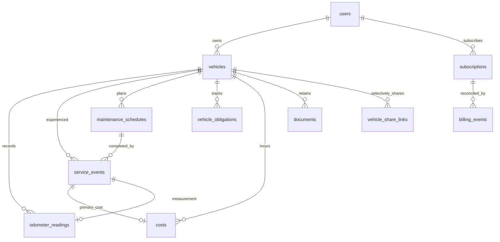

# CaReMind V2 architecture and implementation plan

Status: proposed architecture, 2026-09-17. Planning only; no implementation, migration, provider selection or deployment is authorized by this document. File name follows the requested deliverable; product spelling remains CaReMind.

P0A readiness update: the repository now has a dedicated direct migration connection (`MIGRATION_DATABASE_URL`) and a separate disposable PostgreSQL migration suite (`npm run test:postgres`), with PostgreSQL 17 CI coverage configured. The original inspection findings below describe the planning baseline. See README and AGENTS.md for current commands and connection safety requirements. This update does not implement V2 schema or product features, or establish live Neon verification.

P0B readiness update (2026-09-21): atomic security writes are implemented for password reset, account email/username/password updates and registration email verification. User-first row locking, post-lock code/JWT revalidation and a single checked-out client protect mutation, code consumption and required refresh-session revocation. Login also serializes final credential validation, legacy hash upgrades and session creation with password changes. Administrator role/status changes commit required refresh revocation atomically. Disposable PostgreSQL HTTP tests cover concurrent redemption, rollback/failure injection and cleanup. No migration, refresh rotation, access-token revocation redesign, V2 product feature or deployment is included.

P0C readiness update (2026-09-22): distributed security rate limiting is implemented with atomic Upstash Redis counters over HTTPS, endpoint-specific IP/HMAC identifier quotas, authenticated account quotas and a bounded provider deadline. Abuse-sensitive operations fail closed with temporary 503 responses; refresh alone uses a bounded best-effort per-instance limiter on operational provider failure, while logout remains unblocked so session revocation is available. Production/Vercel configuration and ingress verification remain manual prerequisites; no provider was provisioned or deployment performed. Local tests use memory/fake HTTP only. README records quotas, privacy, outage behavior and setup. No migration, JWT/session architecture change or V2 product feature is included.

P0D readiness update (2026-09-22): the existing Resend abstraction now rejects both returned provider errors and thrown/network failures, cleans up undelivered security codes, and preserves enumeration-neutral public recovery responses. The legacy cron excludes inactive users and completed maintenance, keeps exact-date/zero-day semantics, deduplicates each reminder's email recipients, uses bounded concurrency and returns submission aggregates. No delivery ledger, catch-up, retry queue, scheduler configuration, migration or V2 feature was added. Repeated cron calls can still duplicate reminders and missed runs can still miss them; durable idempotency belongs to the future notification-delivery phase.

P1 completion update (2026-09-22): `/` is now a public product landing page and the preserved login/password-recovery experience lives at `/login`. Protected-page and explicit-logout redirects target `/login`, safe `next` navigation is restricted to known local application pages, and signed-in users may still view the landing page. Existing browser-only Demo entry is available from both public surfaces and still resets into the shared dashboard/tour flow. Vercel and the bundled local server support canonical extensionless routes. No backend API, schema, migration, billing, subscription, onboarding or domain work is included.

P2 completion update (2026-09-22): registration now presents the backend-required email, username and password fields first, defaults to the existing individual account type, and reveals optional business metadata only for the backend-compatible `business` value. Email verification remains mandatory and non-authenticating; success routes through the safe login `next` allowlist to a protected, session-local `/onboarding` welcome page. Its primary action opens the existing vehicle dialog through the exact local `/vehicles?add=1` signal, preserving required chassis/type fields, while skip opens the dashboard. Demo onboarding uses the same page and browser-only store. No API contract, migration, vehicle schema, trial, billing, subscription or P3 work is included.

## 1. Executive summary

CaReMind is the digital ownership record for your vehicle: service history, maintenance reminders, mileage, costs, documents and important obligations in one place. Build for individuals, households using one account, freelancers and very small fleets. A household is not a new authorization boundary or multi-user organisation.

Keep static Vanilla HTML/CSS/JS, Express and PostgreSQL. Evolve the database additively, preserve user ownership, and keep the same UI for production and the browser-only demo. Organise history around a persistent vehicle rather than a list of mutable maintenance settings.

Five central decisions:

1. Vehicle archive is reversible and preserves history; permanent deletion is a separate, strongly confirmed operation.
2. Separate actual service events, future mechanical schedules and date-driven obligations. Never infer recurrence or reliable odometer history from ambiguous legacy fields.
3. Mileage readings retain corrections and provenance. Costs remain the single monetary source of truth, optionally linked to service events.
4. Derive the timeline from source records. Store document metadata in PostgreSQL and file bytes behind a private storage interface; choose a provider later.
5. Centralise entitlements in the backend. Downgrade preserves all records and existing active vehicles; block additional activation when over limit rather than deleting or automatically archiving vehicles.

Highest-risk migration: legacy maintenance classification and the change of write authority. Highest-risk product change: charging previously unrestricted users while retaining trustworthy access to their records. Recommended first implementation PR is a small readiness PR for isolated PostgreSQL migration tests and verified migration connection/locking behavior. The first product PR is the public landing/login separation after the readiness gates below.

## 2. Current-state constraints and evidence

Inspection covered root guidance, README/CHANGELOG, manifests/lockfile, both migration files and runner, SQL adapter, auth/account/admin/resource routes, email/cron, API adapter/demo store, maintenance/vehicle/cost UI, deployment configuration, OpenAPI and existing tests. The working tree was clean at the start of this planning task.

Evidence references are repository-relative; this document describes the schema in checked-in PostgreSQL DDL, not an inspected production database. No real connection, row sampling or schema introspection was performed. Production migration ledger, row volumes, actual values, duplicates and ownership anomalies are unknown and are mandatory preflight inputs later.

| Area | Verified implementation and consequence |
| --- | --- |
| Database | [001](../backend/migrations/001_initial_schema.js) and [002](../backend/migrations/002_align_legacy_schema.js) are the only migrations. BIGSERIAL keys, snake_case SQL, DATE business dates, TIMESTAMPTZ audit dates, NUMERIC(12,2) costs. Do not alter either file or its checksum. |
| Ownership | Vehicles, maintenance and costs carry user_id; costs/maintenance handlers check the selected vehicle. Existing separate FKs do not themselves guarantee that child and vehicle have the same owner. Companies are metadata. |
| Vehicles | [vehicles.js](../backend/routes/vehicles.js) requires vehicleType and chassisNumber; chassis_number is NOT NULL and unique per user. There is no plate, make, archive or detail endpoint. current_mileage is one editable scalar. DELETE physically deletes and FK cascades remove history. |
| Maintenance | [route](../backend/routes/maintenances.js) stores last/next dates and mileages in one mutable row. Types are bounded strings, not a closed enum. Status validation accepts active/pending/completed/overdue; the database has no status CHECK. No recurrence interval, completion ledger, provider, amount or document relation exists. |
| Completion | [UI completeMaintenance](../frontend/maintenance.js) sets lastDate to today's UTC date, lastMileage to nextMileage OR lastMileage, and completed status. It retains the old next fields and sends completedDate, which the backend ignores. Previous last values have already been overwritten; a migration cannot reconstruct them. |
| UI timing | Mechanical oil/service/tires/brakes use mileage-oriented form rules; insurance/kteo/battery use date rules. Battery remains mechanical despite this UI grouping. Cards derive upcoming at seven days or 500 km and can label records with no due fields overdue. An early date branch can mask a more urgent mileage condition. These are UI interpretations, not stored history facts. |
| Costs | [costs route](../backend/routes/costs.js) owns positive amount, date, category, description, receipt_number. No service linkage. pg NUMERIC can arrive as strings; frontend converts with Number. receipt/receiptNumber naming differs in some frontend paths and must be corrected when touched. |
| Reminders | [notifications](../backend/routes/notifications.js) uses dates, per-row notification_days, excludes completed rows, caps at 50 and warns at three days. [cron](../backend/routes/cron.js) selects an exact date, excludes completed rows and inactive users, deduplicates recipients per reminder and submits with bounded concurrency. It still lacks a delivery ledger/durable deduplication, and no scheduler definition is checked in. |
| Auth | [middleware](../backend/authMiddleware.js) accepts HS256 purpose=access with id; reset and account-change JWTs have exact distinct purposes. Refresh is opaque, hashed, HttpOnly, revocable; it does not rotate. Preserve these recent fixes. |
| Backend structure | Route modules contain SQL and business logic. Add small ownership/transaction/domain helpers only where new repeated operations justify them; no ORM or broad controller/repository rewrite. |
| Frontend | Flat multipage scripts/globals; shared ui.js and api.js. `index.html` is the public landing and `login.html` owns login/password recovery. Vercel and the bundled server canonicalize `.html` and serve one-segment extensionless pages. Public/auth classification remains explicit; do not broaden trailing-slash paths into a public-page rule. |
| Demo | [demo-store](../frontend/demo-store.js) version 1, localStorage, generic prefix routing, simplified validation; it preserves arbitrary body fields unlike server projections. Refresh/logout branch locally. Unsupported requests throw. New nested vehicle routes must precede generic prefix matches. |
| Delivery | [migrate.js](../backend/scripts/migrate.js) uses transactions per file and a session advisory lock. vercel-build runs migrations. [db.js](../backend/db.js) translates SQL and configures SSL without certificate validation. Never run migrations against an unknown target. |
| Quality | Node test runner with stubbed SQL/VM browser tests, no real PostgreSQL or full browser suite. CI checks JS and audits dependencies. The earlier task observed 35 passing tests and zero audit vulnerabilities after targeted upgrades; these historical results are not fresh validation for this document. |

Keep existing numeric ID/camelCase JSON contracts on legacy endpoints. New money responses should use documented decimal strings and currency; never silently change old endpoint response types. Use calendar dates for user-entered occurrences and UTC timestamps for system events. Propose Europe/Athens as an editable default timezone, not a legal scheduling rule.

## 3. Target domain model



### Actual history versus plans

A service event records a claimed occurrence, not a future deadline. Support service, repair, inspection and other; preserve the user's descriptive label. A maintenance schedule holds one next occurrence plus optional calendar-month and/or kilometre intervals. Do not implement manufacturer recommendations automatically.

For recurring completion, the user supplies actual date and optionally actual mileage. Next date is actual completion date plus calendar months with end-of-month clamping; next mileage is actual supplied mileage plus interval. With both triggers, due means either is reached. A date threshold must not suppress an already exceeded mileage threshold. Evaluate due first, then upcoming, then scheduled; unknown mileage remains unknown. A mileage recurrence completed without an actual reading enters needs_baseline for that branch and asks for a reading; do not invent one. One-off schedules become completed; recurring ones advance a cycle number. Allow a deliberate later correction with recalculation preview, not a silent rewrite of prior cycles.

Obligations such as insurance/KTEO use user-confirmed dates. KTEO can also have an actual inspection service event and mileage reading, but its next obligation is separate and linked explicitly. Do not automatically derive statutory due dates or imply legal compliance. Renewals should retain a fulfilled old obligation and create its successor; no historical due-date overwrite.

### Mileage semantics

Use kilometres initially; unit conversion and odometer replacement are separate future decisions. Each reading has an occurrence date, recorded timestamp, source, and verification/provenance state. Corrections void an old reading and insert a replacement linked to it, with a reason, in one transaction. Keep both for audit; default displays exclude voided values. Out-of-order historical entry is supported. Validate against adjacent accepted readings; require explicit correction/review for decreasing readings instead of silently taking MAX(value). Backdated valid entries need not change the current displayed mileage.

The latest accepted, non-voided, dated reading determines current mileage using a stable date/recorded_at/id order; conflicting same-day readings require explicit resolution. Imported undated current_mileage remains a labelled baseline until a dated reading is supplied. Historical completion-derived mileages are unverified and cannot update the current value automatically. current_mileage remains a compatibility cache, recalculated transactionally when its authoritative reading changes. Unknown distances produce unavailable cost/km, not zero or fabricated precision.

### Archive and history corrections

Use nullable archived_at: null means active. Avoid a second is_archived flag that can disagree. Archived vehicles are excluded from active lists and automated reminders, remain readable/exportable, and can be restored after an entitlement check. Existing history may be corrected, but no new recurring schedules or future notifications should be activated on archived vehicles. Restoration preserves due dates and shows overdue items without replaying every missed email.

Service corrections use a retained original snapshot/revision record and explicit reason. Ordinary service deletion becomes voiding; linked costs and readings require a previewed choice, not implicit disappearance. Permanent vehicle deletion remains a danger-zone flow with recent reauthentication, confirmation and asynchronous storage cleanup. No account downgrade invokes archive, void or delete operations.

## 4. Proposed database schema

This is a design contract, not executable DDL. Proposed indexes/constraints must be tested against real PostgreSQL and production-like fixtures before migration authoring.

### Shared conventions (apply to every table below unless explicitly overridden)

- PK is id BIGSERIAL, matching the adapter's automatic INSERT RETURNING id behavior. Every table has created_at TIMESTAMPTZ NOT NULL DEFAULT CURRENT_TIMESTAMP. Mutable rows also have updated_at maintained by the existing trigger function through new triggers. Immutable evidence uses created_at only.
- User-owned resources have user_id NOT NULL referencing users(id). Vehicle-scoped rows also have vehicle_id NOT NULL and composite FK (vehicle_id,user_id) to vehicles(id,user_id), plus UNIQUE(id,vehicle_id,user_id) where referenced by children. Add UNIQUE(id,user_id) to vehicles. Child links use full matching user/vehicle scope rather than independent IDs.
- New user/vehicle FKs use RESTRICT for permanent deletion until the orchestrated deletion flow explicitly removes children. This also safely prevents legacy hard deletes after new history exists. Existing CASCADE FKs remain until explicitly reviewed; mixed behavior is intentional during transition.
- Default indexes: each user-owned table (user_id,id); each vehicle history table (user_id,vehicle_id,occurrence_date DESC,id DESC), substituting its actual date column. All referencing FKs receive indexes. Name extra constraints explicitly in implementation. Default no uniqueness beyond PK/composite identity unless stated below.
- Enums use named CHECK constraints on text fields for simple extensibility via future migrations. Nullable legacy fields stay nullable during backfill. Length bounds apply at API and SQL levels. No arbitrary HTML is stored as renderable markup. No new binary columns for documents.

| Table / disposition | Purpose and important fields | FKs, deletion and ownership | Indexes, unique/check constraints, timestamps |
| --- | --- | --- | --- |
| users — evolve minimally | Keep all auth/profile fields. Later trial_started_at/trial_ends_at, deletion_requested_at, deletion_state. Do not equate role with paid plan. | Existing companies FK remains SET NULL. User is owner, never company. | Existing username/email uniqueness; trial dates both null or end>start; deletion state active/pending/processing. Existing created/updated timestamps. |
| companies — unchanged | Profile name only. | Existing user relation; not an entitlement principal. | Existing name/lower-name indexes and created_at retained. |
| vehicles — evolve | Preserve vehicle_type, chassis_number, model, year,current_mileage. Add plate, registration_country, make, fuel_type, purchase_date, purchase_amount,currency, archived_at and revision. Keep raw model/chassis values. | users FK currently CASCADE; orchestration/restricting children protect future permanent deletion. | UNIQUE(id,user_id); partial index (user_id,id) WHERE archived_at IS NULL; nonnegative mileage/purchase amount, year bounds without time-dependent CHECK, uppercase currency length=3; revision>0. No global plate uniqueness. Optional per-user plate duplicate warning; ownership/plate changes make hard uniqueness premature. |
| odometer_readings — new | occurrence_date nullable for legacy baseline only, mileage_km, source manual/service/kteo/import, confidence confirmed/legacy_unverified, voided_at, correction_reason, replaces_reading_id, optional service_event_id. | Vehicle composite FK; replacement FK within same user/vehicle; optional service FK same scope, RESTRICT. Corrections never delete original. | Default date index; UNIQUE(service_event_id) WHERE nonnull; UNIQUE(replaces_reading_id) WHERE nonnull; mileage>=0; date required unless source=import; void reason required when voided; no self-replacement; created/updated. Validate replacement cycle and neighboring mileage in locked transaction. |
| service_events — new | occurred_on nullable only for legacy unknown-date events; type, label, provider_name, description, notes, mileage_claim nullable, confidence, source manual/legacy/schedule, maintenance_schedule_id nullable, schedule_cycle nullable, voided_at, revision. Actual authoritative mileage lives in linked odometer reading; mileage_claim preserves unverified legacy evidence only. No amount column. | Vehicle FK; schedule composite FK RESTRICT added after both tables exist. | Default date index; UNIQUE(maintenance_schedule_id,schedule_cycle) WHERE nonnull; nonnegative claim; paired schedule/cycle, cycle>0; manual/schedule require date; bounded text; created/updated. |
| service_event_revisions — new | Before-image JSONB, revision_number, reason, actor_user_id; immutable correction evidence. | Parent event full-scope FK RESTRICT; owner user FK; actor FK SET NULL for future deletion handling. | UNIQUE(service_event_id,revision_number); revision>0 and JSON object CHECK; parent index; created_at only. Never use JSON snapshot as main query model. |
| maintenance_schedules — new | type,label, notes, next_due_on,next_due_km, interval_months,interval_km, baseline_on,baseline_km, notification_days,notification_km, state active/paused/completed/needs_review/needs_baseline, cycle_number,revision. Trigger semantics always OR when both present. | Vehicle full-scope FK; actual completions reference this row. | (user_id,next_due_on) filtered active, vehicle index; positive intervals, nonnegative mileages/notification_km, notification_days 0..365; active needs at least one due threshold; no calculated recurring interval from legacy fields; created/updated. |
| vehicle_obligations — new | type kteo/insurance/emissions_card/road_tax/other, label,due_on,notification_days, fulfilled_on, state active/fulfilled/paused/needs_review, notes, previous_obligation_id, optional service_event_id,revision. | Vehicle FK; previous obligation and optional service same scope RESTRICT. | (user_id,due_on) filtered active; UNIQUE(previous_obligation_id) WHERE nonnull; due date required if active; fulfilled_on required if fulfilled except documented legacy unknown cases in needs_review; notification_days 0..365; no automatic law-based recurrence; created/updated. |
| costs — evolve | Retain existing fields/IDs/amounts. Add currency default EUR, optional service_event_id, voided_at,revision; amount remains authoritative. A service form creates or links one primary cost. Existing independent costs remain independent. | Existing user/vehicle FKs retained, add full-scope service FK RESTRICT. | UNIQUE(service_event_id) WHERE nonnull (one primary total per service in V2); existing date/owner indexes, amount>0 and currency format; created/updated. No zero-amount row for free service. Void audit retained through service revision/operation evidence; no automatic refund model. |
| documents — new | kind,title,original_filename,storage_backend,object_key,media_type,byte_size,sha256,status pending/scanning/ready/rejected/deleting/deleted, occurred_on nullable, optional service_event_id,cost_id,obligation_id; deleted_at. Bytes external. | Required vehicle owner; all optional links scoped to same vehicle/user and RESTRICT. At most one primary attachment target, or vehicle-only. A service-linked receipt can be discovered from its linked cost. | UNIQUE(storage_backend,object_key); vehicle/date and (status,created_at) indexes; size>0 and policy cap, checksum format; <=1 target link; deleted state/date consistency; created/updated. Do not use client-provided object keys. |
| notification_preferences — new | user_id, email_enabled, timezone, local_send_time; future channel/category choices only when implemented. No marketing consent conflated with transactional reminders. | One owner; user RESTRICT pending deletion orchestration. | UNIQUE(user_id); boolean fields; validate timezone against supported zones at API; created/updated. |
| notification_recipients — evolve | Keep type,value,is_active; add verified_at and verification workflow before new extra recipients receive private reminders. Do not assume old entries verified. | Existing user-owned, no vehicle sharing rights. | Existing UNIQUE(user_id,type,value) retained; re-add should reactivate after verification, not INSERT conflicting soft-deleted entry; normalized value and existing type/activity CHECKs; add updated_at. |
| notification_deliveries — new | user/vehicle, schedule_id OR obligation_id, cycle_key, recipient snapshot, channel, due_on, planned_send_at, state pending/sending/sent/failed/cancelled, attempts,lease_until,provider_message_id,last_error_code. | Full ownership FKs RESTRICT; one source exactly, no free polymorphic target IDs. Recipient text is minimal delivery evidence, purged under retention policy. | UNIQUE(user_id,source_key,cycle_key,recipient_key,channel) with canonical generated/application-validated source_key; due-work index (state,planned_send_at); attempts>=0, source XOR; created/updated, sent_at. Recheck eligibility before dispatch. |
| vehicle_share_links — new, later | token_hash SHA-256, vehicle/user,expires_at,revoked_at, allowed_sections, redaction_policy_version, snapshot_cutoff, snapshot_payload JSONB containing only the bounded redacted projection. Revocable read-only immutable snapshot, no account JWT. | Vehicle composite FK RESTRICT; neither recipient nor viewer gains ownership. | UNIQUE(token_hash); user/vehicle index and expires_at cleanup index; bounded expiry/payload size, JSON object CHECK, explicit section allowlist and no documents by default; created_at, revoked_at (no generic content mutation). Rotate by new row. |
| subscriptions — new, later | user_id,plan_key,provider,provider_customer_id,provider_subscription_id,status,current_period_start/end,cancel_at_period_end,ended_at,provider_revision. Store paid provider state; FREE is fallback, trial on users. | User RESTRICT while reconciliation/retention pending; no company FK. | UNIQUE(provider,provider_subscription_id); partial UNIQUE(user_id) for current subscription states; valid known plan/status, end>start; created/updated. Database status alone does not override effective-period rules. |
| billing_events — new, later | provider,event_id,event_type,received_at,processing_state,payload minimal JSONB,payload_hash,subscription_id,user_id,last_error_code,attempts,processed_at. | Nullable resolved user/subscription FKs SET NULL for retention-safe deletion; no public read API. Provider receipt may arrive before association. | UNIQUE(provider,event_id); state/received index; attempts>=0, JSON object CHECK; created_at plus received/processed timestamps. Retention/pseudonymisation decision required before launch. |
| operation_requests — new | user_id,operation,idempotency_key,request_hash,state,result reference IDs/summary,expires_at,attempts,lease_until. For service completion and other retryable mutations; later PDF export work can use queued/running/succeeded/failed states and a private result object reference. | User RESTRICT; ownership on returned references rechecked. | UNIQUE(user_id,operation,idempotency_key); expiry and state/created indexes; canonical hash, bounded key and state, attempts>=0; created/updated. Reuse key with different payload returns 409. |
| legacy_maintenance_mappings — new | maintenance_id,user/vehicle,source_snapshot JSONB,source_hash,source_updated_at,mapping_version,classification,review_state,event_id/schedule_id/obligation_id nullable,reviewed_at. Supports zero, one or several justified outputs per row through fixed optional references. | Legacy row and every output use matching ownership FKs RESTRICT; retain raw original row too. | UNIQUE(maintenance_id); review-state/user index; at least snapshot/object/hash; mapping_version>0; created/updated. No guessed output required. |
| storage_cleanup_jobs — new with documents | storage_backend,object_key,reason,state,attempts,lease_until,next_attempt_at, optional owner reference. | Owner nullable SET NULL; must survive account/vehicle deletion. Minimal opaque key only, no filename/PII. Not client-accessible. | UNIQUE(storage_backend,object_key); state/next_attempt index; attempts>=0; created/updated. |
| account_jobs — new with privacy | user_id nullable,kind export/delete,state,idempotency_key,progress,expiry,private export object reference. | User SET NULL after deletion; opaque job receipt, no retained profile in payload. | UNIQUE(user_id,kind,idempotency_key); state/created and expiry indexes; allowlisted kinds/state; created/updated. Export objects require cleanup jobs. |

Vehicle optional VIN strategy: initially add vin separately, leave chassis_number untouched for coexistence. It is legacy evidence, not automatically a validated VIN or plate. After all writers/readers tolerate absent chassis_number, a new migration relaxes its NOT NULL constraint; keep the old column and its unique constraint for nonnull values. No generated fake chassis number. Confirmed VIN uses a nullable canonical value and partial per-user unique index; validate ordinary modern VINs without rejecting historical/nonstandard legacy evidence. Registration plate is user-entered; do not transform chassis text into a plate.

Existing tables not replaced: users, companies, vehicles, costs, notification_recipients, interest_requests, refresh_tokens, email_verification_codes, verification_codes, password_reset_codes, schema_migrations. Auth tables remain structurally unchanged except separately approved readiness hardening. Maintenances becomes a read-only legacy evidence source after cutover, not dropped in V2. Existing code-table expiry/cleanup policies remain a separate concern. All new operational tables above are introduced only at their phase, not in one speculative mega-migration.

## 5. Existing-data migration mapping

### Field-by-field mapping

| Actual field / alias | Current meaning | Target and determinism | Safest treatment |
| --- | --- | --- | --- |
| id | Mutable maintenance record identity | Deterministic provenance key; not a service identity | Retain old ID, use mapping FK; new resources get their own IDs. |
| user_id / vehicle_id / vehicleId | Row owner and selected vehicle | Deterministic only after full-chain validation | Quarantine mismatches for manual resolution; never reassign to guessed owner. |
| maintenance_type / maintenanceType | Standard code or arbitrary custom string | Exact insurance/kteo codes suggest obligations; mechanical codes suggest schedules/events; custom strings ambiguous | Preserve raw text; allowlist code classification, no fuzzy Greek/English string matching. Battery stays mechanical. |
| last_date / lastDate | Last maintenance date; also overwritten on completion | Candidate occurrence date, not proof of a service; no recurrence semantics | Copy as legacy claim with confidence flag; preserve raw snapshot. Never use created_at to fabricate occurred_on. |
| next_date / nextDate | Absolute future/past due date | Deterministic one-off due date when noncompleted; not an interval | Copy due date for eligible schedule/obligation. Completed-row next date is residual evidence and must not activate a new reminder automatically. |
| last_mileage / lastMileage | Last service mileage OR copied planned mileage during completion | Ambiguous factual reading | Preserve mileage_claim/legacy snapshot, do not seed accepted odometer history. Ask user to confirm. |
| next_mileage / nextMileage | Absolute due odometer value | Can become next_due_km, never interval_km by subtraction alone | Copy threshold for noncompleted mechanical schedule. Preserve even on date obligations as legacy evidence, with review flag. |
| notification_days / notificationDays | Date warning offset 0..365; API default 7 | Deterministic notification offset, not recurrence period | Preserve zero and null distinction in snapshot; valid nonnull copied unchanged. Review unexpected legacy values. |
| status | active/pending/completed/overdue accepted by API; DB unconstrained | completed is a user claim; other states do not prove actual work | Preserve status string. Recompute future due state from data; unknown statuses go to needs_review. Do not infer event from stored overdue. |
| notes | Unstructured text | No safe machine classification of amounts/provider/date | Copy without parsing into facts, retain raw snapshot and render escaped. |
| created_at / updated_at | Record bookkeeping, not necessarily event date | Deterministic source timestamps and mutation watermark | Preserve provenance; show separately from occurred_on. Current GET exposes created_at, not updated_at. |
| lastMaintenance / nextMaintenance / type | Names in product examples, not actual backend field names | No server column mapping | Map only known lastDate/nextDate/maintenanceType API aliases; do not invent input compatibility. |
| completedDate / createdAt | Sent by UI, ignored by server; demo generic store can retain them | Not recoverable from production DB | Do not promise recovery. Demo import may preserve them as additional evidence without assuming production equivalence. |

### Classification decision table

| Source case | Proposed output | Automatic confidence / follow-up |
| --- | --- | --- |
| Noncompleted exact insurance/kteo with valid next_date | One active vehicle obligation, carrying due date and warning offset | Deterministic reminder classification; last fields remain historical claims, not an invented service. Mileage fields trigger review note. |
| Noncompleted recognised mechanical type with next date/km | One one-off maintenance schedule; intervals null | Preserve existing reminder intent. Last fields are optional unverified baseline evidence. User opts into recurrence with explicit intervals. |
| Completed recognised mechanical type | One legacy service event with last_date if present, mileage_claim and confidence=legacy_unverified | Does not create authoritative odometer/cost. Unknown date remains null and clearly displayed. Residual next fields only in legacy snapshot. |
| Completed exact insurance/kteo | Historical obligation evidence in needs_review; user confirms fulfillment/date before successor | Do not label insurance a mechanical service. Optional KTEO inspection event only on confirmation. |
| Custom type, missing due fields, invalid state, inconsistent dates/ownership | Mapping row with needs_review and untouched legacy source; no operational output | Generic “Imported maintenance record” visible in Vehicle Detail legacy history/review inbox; no silent loss and no automatic email. |
| Noncompleted row with last date and next threshold | Schedule/obligation plus preserved prior-work claim | Do not automatically create both service and schedule unless user confirms the historical occurrence. Mapping can later link both. |

Never infer cost from notes or link existing costs by date/amount coincidence. All existing costs stay independent until a user deliberately links one. Never calculate recurring months/km from next-minus-last: the last fields may have been rewritten or thresholds may be one-off.

Migration procedure: export counts/hash manifest and encrypted backup outside Git; rehearse on anonymised fixtures; snapshot each source row once with mapping version/hash; classify in bounded restartable batches; reconcile every source row to exactly one mapping, including needs_review; compare all raw fields and counts; run user preview. Resume via keys/checkpoints, never DELETE/reinsert targets. Rows changed since source_updated_at require reclassification before switch, not silent overwriting of a user-reviewed target. Retain original source and snapshot until a separately approved retention/deletion policy applies. Historical values already overwritten by V1 cannot be recovered without independent backups.

## 6. Authorization model

Every private request derives user_id from verified purpose=access JWT middleware and its current database user. Do not accept owner changes in resource bodies. A body vehicleId, serviceEventId or documentId is a locator, never proof of access.

| Resource | Required server checks |
| --- | --- |
| Vehicle/detail/timeline/export | Vehicle id AND req.user.id; archived status affects actions, not ownership. Filter each timeline branch by the same owner. |
| Reading/service/schedule/obligation/cost | Child id AND user_id AND vehicle_id; independently verify supplied parent vehicle. Lock vehicle for relevant mutations. |
| Document | Document owner → vehicle owner → optional service/cost/obligation belongs to that same vehicle/user. Enforce again at upload finalisation and download signing. |
| Preferences/recipients | req.user.id scope; recipient verification does not grant any account access. |
| Subscription/entitlements | User can read effective capabilities and initiate allowed checkout/portal operation; cannot write plan, paid state, trial end or provider IDs. |
| Webhook/billing event | Provider signature over raw body, bounded size, replay/idempotency checks; resolve server-side customer mapping. No frontend user_id authority. Separate route-specific raw-body parsing before global JSON parser. |
| Share link | Public token hash lookup, expiry/revocation/archive policy checks and explicit snapshot projection. Never accept as bearer JWT; read-only scoped view, rate limited, no private asset keys. |
| Cleanup/account jobs | Internal worker credentials; never expose operation payloads or keys through general resource routes. |

Add modest helpers such as requireOwnedVehicle(executor,userId,vehicleId,{forUpdate}) and requireOwnedService(executor,userId,vehicleId,eventId). Pass the transaction connection explicitly; do not run half the operation through the pool. Resource-specific validation stays near its route/domain operation. Preserve current admin/owner checks but do not grant admin automatic customer document access; any future support access needs a separately audited design. Return 404 for foreign resources, 409 for stale revision/idempotency conflicts, and structured entitlement errors for limits.

## 7. Transaction boundaries and external side effects

| Operation | PostgreSQL transaction | External work / retry behavior |
| --- | --- | --- |
| Complete schedule | Lock owner user then vehicle then schedule in consistent order; validate archive, entitlement and expected revision/cycle; claim idempotency key; create event, optional confirmed reading and optional cost/link; advance schedule; update mileage cache; enqueue reminder changes; save result; commit all or none. | No email inside transaction. Duplicate completion returns same result; same key/different body 409; different keys for same cycle hit unique completion constraint. |
| Standalone service bundle | Same vehicle lock; event+optional reading+cost+document metadata links validated together; record idempotency result. | Upload bytes handled independently; only ready owned documents can be attached. |
| Mileage correction | Lock vehicle and affected readings; validate neighbors; mark original void, insert correction, update cache and relevant schedule projections atomically. | Preview warnings; never retroactively manufacture already sent alerts. |
| Archive/restore | Lock user then vehicle; archive or restore + revision + reminder eligibility changes. Restore/create counts under same user lock as quota check. | Cancel pending notifications; revoke share links on archive by proposed conservative policy. Do not replay missed deliveries on restore. |
| Permanent vehicle deletion | Reauthentication proof bound to operation; mark deletion pending, revoke shares, collect storage keys into cleanup jobs, then delete owned graph in dependency order. Costs/legacy evidence deleted only after explicit confirmation. | Physical files cannot share a DB transaction. Commit durable cleanup jobs before rows vanish; retry deletion and orphan reconciliation. |
| Account deletion | Mark account inactive/deletion pending and revoke sessions first; durable account job coordinates owned-graph cleanup, company removal only if unused, trial/access shutdown and export expiry. Batches lock/check account state; final deletion transaction verifies no remaining private resources. | Cancel provider subscription through retryable task before final deletion; retain only explicitly justified pseudonymised billing evidence. Cleanup jobs survive FK removal. Never claim an external delete rolled back with SQL. |
| Subscription webhook | Insert unique provider event; validate association; lock user/subscription; apply monotonic provider revision or reconcile authoritative state; update entitlement inputs and event result atomically. | Fetch provider state outside transaction if necessary, retry against version check. Late events must not resurrect cancelled subscription. Failed processing remains retryable. |
| Upload/delete document | Reserve owned metadata/quota; upload; validate object exists/size/hash/type; transition to ready only after required scan. Deletion marks hidden and queues key cleanup atomically. | Private temporary objects expire; worker verifies/scans without executing content; handle upload success/DB failure with orphan sweep. Storage retries need bounded backoff. |
| Reminder dispatch | Atomically claim eligible delivery with lease; unique occurrence/recipient key prevents duplicate scheduling. | Send after commit, inspect provider errors, record provider ID. Crash after send can still duplicate unless provider idempotency/reconciliation is available; do not promise exactly-once mail. |

## 8. API evolution

Keep /api and existing response shapes where feasible; do not add a global /v2 namespace solely for naming. New resources can be introduced alongside old ones. New list endpoints use cursor pagination; legacy lists keep arrays until explicitly versioned. Version/revision preconditions prevent lost updates. All contract changes require docs/openapi.yaml in their implementing PR.

| Proposed endpoints | Contract and coexistence |
| --- | --- |
| GET/POST /vehicles; GET/PATCH /vehicles/:id | Add detail and partial update. Keep PUT legacy projection during transition. GET default active only after archive-aware rollout; ?state=archived/all explicit. Nullable VIN/plate fields introduced additively. |
| POST /vehicles/:id/archive, /restore | Explicit idempotent state transitions; restore checks quota. Existing DELETE remains permanent but is gated behind confirmation/reauth, not silently reinterpreted as archive. Old client DELETE gets actionable conflict once archive workflow launches. |
| POST /vehicles/:id/deletion-requests | Danger-zone async deletion; DELETE compatibility handler can delegate only with equivalent proof. |
| GET/POST /vehicles/:id/odometer-readings; POST /odometer-readings/:id/corrections | Append/correct with expected revision; legacy PUT currentMileage becomes a dated manual reading only once user explicitly supplies date/confirmation, otherwise reject that mutation after cutover. |
| GET/POST /service-events; GET/PATCH /service-events/:id; POST /service-events/:id/void | Filter by vehicleId, preserve same-owner checks; bundle input optional reading and existingCostId OR new cost, never both. |
| GET/POST /maintenance-schedules; PATCH /maintenance-schedules/:id; POST /maintenance-schedules/:id/completions | Explicit due thresholds/intervals, transactional completion with idempotency key/cycle. |
| GET/POST /vehicle-obligations; PATCH /vehicle-obligations/:id; POST /vehicle-obligations/:id/renewals | Date obligations; renewal creates successor and records old fulfillment. |
| Existing /costs CRUD | Keep existing array/amount fields; add serviceEventId and currency. Linked costs require conflict/void semantics, not deletion silently changing service totals. Later cursor endpoint optional. |
| POST /vehicles/:id/documents/upload-intents; POST /documents/:id/complete; GET /vehicles/:id/documents; GET /documents/:id/download; DELETE /documents/:id | Upload validation and signed private download; 202 deletion while cleanup runs. No arbitrary fetch-by-URL upload. |
| GET /vehicles/:id/timeline | Derived feed, filters/kinds, stable cursor (effective date,kind,id), null-date legacy bucket explicitly separate. Permissions and archival visibility on every UNION branch. |
| GET /account/entitlements; GET /account/subscription; POST /account/trial; POST /billing/checkout; POST /billing/portal; POST /billing/webhooks/:provider | Read effective limits; verified-user once-only trial; paid state only through verified provider/reconciliation. Provider deferred. |
| GET/PATCH /account/notification-preferences; existing /account/recipients | Verify new recipients; no SMS promises. /notifications remains adapter projection of combined schedules/obligations during transition, then explicitly documented enriched schema. |
| POST /vehicles/:id/history-exports; GET export job; POST/DELETE /vehicles/:id/share-links; GET /shared/vehicle-history/:token | PDF from same history projection; selective read-only sharing, no account/session token substitution. Redacted snapshot contract. |
| GET /vehicles/:id/legacy-maintenance; POST /legacy-maintenance/:id/classification | Read original evidence and confirm migration candidates; prevent cross-owner links and duplicate outputs. |
| POST /account/exports; POST /account/deletion-requests; GET /account/jobs/:id | Later privacy flows, recent reauthentication, owned expiring results, no ordinary GET causes deletion. |

Legacy /maintenances stays writable only until a controlled per-user domain cutover. Before enabling new writes, deploy a compatibility release to all backend instances that can block legacy mutation for cutover users with 409 plus refresh guidance. Drain old functions and stale cron execution paths first. Do not dual-write unrelated legacy and new models indefinitely. For not-yet-cutover users, legacy remains authority; for cutover users, new resources are authority and /maintenances is a read-only projection/provenance view. Feature capability response drives the shared UI and prevents double display. Rollback after new writes means rolling back to the compatibility release with new history readable, not to the original V1 binary.

## 9. Frontend information architecture

Public: landing at /, pricing, login, register, privacy and terms. Move current index login into login.html with a deliberate redirect transition. Update api.js/auth.js/auth-guard.js public-page allowlists, logout redirects, demo entry, next-path validation, social metadata/tests and frontend/vercel.json together. Avoid treating every trailing slash as public. Preserve existing bookmarks via explicit redirects. Do not advertise paid checkout until entitlements/billing are ready.

Authenticated primary navigation: Dashboard, Vehicles, Reminders, Costs, Account. Global Service is a cross-vehicle filter view if usage warrants it, not mandatory navigation initially. Documents belong primarily to Vehicle Detail; add global search only when volume justifies it. Billing is inside Account. On small screens show a short primary navigation with accessible overflow, not ten equal tabs.

Dashboard first answers “What does my vehicle need next?”: overdue obligations/schedules, approaching deadlines, missing mileage/conflicts, then fast add-service/add-reading actions. Secondary summaries show spending and fleet counts; avoid filling the initial screen with charts. Aggregate only authorised records and show archived-history filter separately.

Vehicle Detail is initially a flat vehicle.html?id=... page compatible with the existing static hosting; pretty nested URLs are optional later.

| View | Source and behavior |
| --- | --- |
| Header | Vehicle make/model/plate, archive state, current mileage with observation date/confidence, edit/archive/restore actions. Full VIN hidden by default in shared/public views. |
| Overview | Vehicle fields, nearest due schedule/obligation, current accepted mileage, quick service/reading actions, legacy review banner. |
| Timeline | Derived service/readings/costs/fulfilled obligations/documents plus labelled legacy evidence; group linked cost/reading/document under service to avoid duplicate cards. Standalone items remain visible; future obligations appear as upcoming, not completed history. |
| Service | Actual service events with associated mechanical schedules below/in a separate subview. “Log service” differs from “Plan maintenance.” Completion form collects actual date/mileage once. |
| Costs | Existing costs filtered by vehicle; service amount shown from the same cost row. No independently editable copied amount. Annual/rolling 12-month analytics use date boundaries and currency, not all-time totals relabelled. |
| Documents | Ready owned metadata and safe downloads; source attachment links; pending/rejected states and retry guidance. |

Timeline implementation: database query/read service using UNION ALL projections, canonical event kind + source ID and deterministic ordering. Do not persist a duplicated timeline table. Grouping is a view concern with link references; document upload time and document occurrence date are distinguished. Same source record must appear once per requested mode; timeline summary amount must not add service and cost totals twice. Index source tables before considering a materialised projection. Unknown dates stay explicit rather than borrowing created_at.

Sharing is an intentional exception to live derived presentation: freeze only the explicitly selected, redacted projection in the share link's bounded snapshot payload. A cutoff timestamp alone would not freeze edits to existing source rows. This snapshot is not the authoritative timeline and is revoked/regenerated after corrections when the owner chooses; deleting or archiving the vehicle revokes access immediately.

## 10. Demo-mode strategy

Retain CaReMindDemo.request as the strict network boundary. Bump demo schema version when needed with deterministic local migration or a clearly announced reset of demo-only data; never clear production metadata/real account records accidentally. Use route matching by exact method/path before generic collections. Simulate time using an injectable clock for repeatable trial/reminder tests.

| Domain | Required demo work | Exact parity versus acceptable simulation |
| --- | --- | --- |
| Vehicles/archive | Seed plate/make/archive; active filters and restore; preserve all children | Same state transitions, counts, validation and errors; no physical production writes. |
| Mileage | Reading collection, correction links, baseline/conflict fixtures, cache derivation | Same chronology and current-value rules; local transactions via clone/validate/save once. |
| Service/schedules/obligations | Separate collections, legacy review examples, completion bundle and renewal | Same recurrence/OR/date arithmetic, idempotency and duplicate prevention; no email. |
| Costs | Linked primary cost, currency, one-entry amount handling | Same totals/linking rules, decimal normalization and void behavior. |
| Documents | Metadata + fixture files or transient Blob references; explicit simulated uploads | Same states/link ownership/size UI; scanning and storage signing simulated. Do not persist huge binaries in localStorage or call production storage. |
| Timeline/export/share | Derive from local records with same grouping | PDF can be local when feasible; share preview is local-only, no publicly working URL promise. |
| Notifications | Unified due predicates, archived exclusion and preference controls | Exact severity/window/zero-offset semantics; simulated delivery log, no mail sent. |
| Subscription/trial | Plan/trial fixtures, clock advance, archive count and over-limit cases | Same effective capabilities/limits; checkout/portal/webhooks simulated, no real payment link. |
| Privacy | Local export/reset flow | Clearly label demo reset; never use real account deletion endpoints. |

Shared pure date/entitlement calculations can later be small browser-compatible modules consumed by backend/tests, but do not introduce a bundler for this purpose. At minimum share fixture contract tests if sharing runtime code would complicate the current globals. Security still lives on the production backend. Test every added adapter method with network access forbidden, including fallback/error paths and logout.

## 11. Subscription and entitlement architecture

These prices are supplied product requirements, not an implemented price catalogue or a tax determination:

| Plan | Monthly | Annual | Active vehicles |
| --- | --- | --- | --- |
| FREE | EUR 0 | EUR 0 | 1 |
| PERSONAL | EUR 2.49 | EUR 24.90 | 2 |
| PLUS | EUR 4.49 | EUR 44.90 | 5 |
| FLEET LITE | EUR 9.90 | EUR 99.00 | 15 |

Store price amounts as integer minor units in a versioned server catalogue, map provider price IDs server-side later. Do not trust a client amount/plan/expiry. Tax inclusion, invoicing, supported markets and cancellation/refund policy remain launch decisions; no legal conclusions are made here.

Propose a single no-card 14-day PLUS trial started by explicit action after email verification, at most once per user. Lock user while starting; timestamp-driven expiry must work even if cron never runs. Effective entitlement order: eligible paid subscription for current period; otherwise unexpired trial; otherwise FREE. Past-due grace, cancellations and existing-user transition policy must be approved before enforcement. Trial grants five active vehicles. Do not start trials for all legacy users during schema backfill.

Implement a focused backend entitlements module returning capabilities and limits, e.g. maxActiveVehicles, canCreateVehicle, canRestoreVehicle, canUploadDocuments, historyReadAllowed. Initially only vehicle-count tiers are specified; do not invent paid-only history/export privileges. Future storage quotas belong in this central policy once defined. Frontend consumes GET /account/entitlements for explanations, never as enforcement authority. Role=admin does not automatically mean paid/unlimited; support exemptions would need explicit audited configuration.

On expiry/downgrade, keep all vehicle states and data. Proposed over-limit behavior: allow reading, export, history correction and existing-vehicle maintenance; block creating/restoring additional active vehicles until below limit or upgraded. Offer user-chosen archive. Existing over-limit active vehicles remain counted; grandfathered excess is visible, not hidden. User lock makes concurrent create/restore checks atomic. Quota enforcement is a dedicated activation phase with a migration preview and customer communication, not an incidental schema default. This policy avoids denying safety-related reminders merely because trial ended; final commercial approval remains outstanding.

Provider abstraction boundary: checkout/portal creation, webhook signature verification, subscription retrieval, cancellation and idempotency mapping. No provider or SDK selected now. Verified payment events feed subscriptions/billing_events; browser redirects never grant paid rights. Archive, deletion, and subscription processing acquire user locks consistently. Keep billing payloads minimal and avoid logging tokens, payment information or full webhook bodies.

## 12. Migration sequence and deployment safety

Current maximum is 002. Proposed filenames below are reservations only; recheck the directory before authoring. Do not create empty placeholder migrations. Each new file is immutable once applied. The runner sorts lexicographically and wraps each file in a transaction; CREATE INDEX CONCURRENTLY cannot simply be put inside it. Use ordinary indexes for measured small tables, or a separately designed nontransactional operational path if size demands it. Do not silently alter the runner's guarantees.

Universal preflight: verified dedicated migration connection with session-lock semantics; recorded checksum ledger; backup/restore rehearsal; row counts and anomaly report; representative timing/lock measurements; statement/lock timeout strategy. Code must tolerate additive columns/tables before feature enablement. Long data backfills run as separate resumable operations, not during Vercel build. SQL below is validation guidance only and has not been run.

| Proposed migration | Schema and backfill | Coexistence / activation | Rollback risk and required validation |
| --- | --- | --- | --- |
| 003_vehicle_identity_archive.js | Add nullable plate,country,make,fuel,purchase,vin,archived_at,revision; owner composite unique/index. No guessed identity backfill, archive null for all. | Old writers continue with chassis_number; deploy archive-aware list/mutation/cron compatibility first, drain old code before archive activation. | Additive rollback to compatibility release; original code can display archived cars and hard-delete them, so not a supported rollback. Validate vehicle count unchanged and SELECT count(*) FROM vehicles WHERE archived_at IS NOT NULL =0 before activation. |
| 004_odometer_readings.js | Reading table, without service link until 005; nonnull current_mileage becomes unverified import baseline with unknown occurrence date, idempotent source marker UNIQUE(vehicle_id,user_id,source_marker) for baseline. | First release mediates old currentMileage writes; drain older scalar-only writers, backfill under vehicle lock, then enable new readings. | Keep cache and rows on rollback. Validate one baseline per source vehicle and exact mileage match; neighbor anomalies reported, not fixed by MAX. |
| 005_service_domain.js | Service events/revisions, schedules, obligations, operation_requests; add reading service FK once targets exist. Empty tables initially; composite FKs. | Old maintenances remains authority until per-user switch; new endpoints gated off. | Additive only; validate FK definitions and empty tables, failure injection for completion rollback, two-user attachment constraints. |
| 006_legacy_maintenance_mapping.js | Mapping/evidence table; add users maintenance_domain_version default 1, CHECK in (1,2). Resumable snapshot/classification backfill outside migration. | Deploy code understanding both authorities; drain old writers/cron, lock a user's maintenance writes briefly for final reconciliation, then atomically mark version 2. UI polls capability; stale writes get 409. | Highest risk: cannot revert to V1 after new-only data. Validate mapping coverage, exact hashes, output ownership, no duplicates, review counts; enable in cohorts with rollback to read-only compatibility. |
| 007_cost_service_link.js | Nullable scoped service FK, partial unique primary-cost index,currency EUR,voided_at,revision. No automatic cost linking. | Existing standalone costs work; new writer reads cost as monetary authority. Guard legacy DELETE/PUT for linked rows. | Old clients cannot safely edit linked costs; keep compatibility guard. Compare pre/post counts and SUM(amount) by user/vehicle, zero foreign-owner links, unique service link. |
| 008_notification_delivery.js | Preferences, delivery ledger, recipient verified_at/updated_at. Preserve recipients; unknown verification remains null. | Deploy dual-source reminder resolver keyed by user's domain version before switching cron; old and new cron cannot run concurrently. New preference defaults preserve current eligibility until verification transition communicated. | No rollback to unledgered sending. Validate no completed/archived/inactive candidates, duplicate occurrence keys absent, overdue catch-up bounded and zero offsets preserved. |
| 009_documents_storage_jobs.js | Document metadata and durable cleanup jobs; no file backfill exists. | Upload disabled until provider/scan/limits/cleanup design separately selected and tested. Old UI unaffected. | DB rollback cannot delete uploaded bytes; retain metadata/cleanup workers. Validate scope FKs, unique object keys, pending expiration, cleanup surviving owner deletion. |
| 010_vehicle_share_links.js | Hashed expiring link records; default no links. | Public route enabled only after redacted projection tests. | Disable route and revoke links; retain rows for bounded audit. Validate token uniqueness/length, scope, expiry and absence of raw tokens in storage/logs. |
| 011_subscription_entitlements.js | Subscriptions,billing_events; users trial timestamps; no paid or trial backfill, FREE effective fallback but enforcement flag off. | Old product access remains until explicit enforcement rollout. Backend capability reads first, billing provider/events later. | Disable new checkout/enforcement, keep reconciliation/webhook processing. Never remove billing evidence to roll back. Validate zero accidental trials, one current subscription per user, duplicate/out-of-order webhook fixtures and concurrency quota tests. |
| 012_vehicle_legacy_identifier_relaxation.js | Relax chassis_number NOT NULL only after compatible readers/writers deployed; keep values/index; add confirmed VIN partial uniqueness after duplicate preflight. | Must land before optional-VIN onboarding is enabled; identity form can initially be additive. Never create fake chassis identifiers. | Original V1 cannot handle new nulls; rollback only to null-tolerant compatibility version. Validate untouched old chassis values, null VIN accepted, duplicate confirmed VIN rejection. |
| 013_privacy_jobs.js | Deletion fields on users, account_jobs; any audited FK changes required for orchestrated deletion. No automatic deletion/backfill. | Existing admin deletion must delegate to same workflow before launch; disable incompatible hard-delete action. | External deletion irreversible; rollback disables new requests but drains accepted jobs. Validate empty job queues before activation, graph deletion fixture, billing pseudonymisation and storage cleanup retention. |

Ordering note: 012 is deliberately a late contract-relaxation migration, not a requirement to delay the whole archive/detail phase. Optional-VIN creation remains gated until then; if product prioritises it earlier, move that migration earlier before any of these are applied and update the roadmap. Privacy planning/testing begins early but 013 must be available before paid public launch, even if billing work is already implemented behind flags. No schema contraction/drop of maintenances is planned in V2.

Example preflight/reconciliation queries to turn into tested operational checks later:

```sql
-- Existing schema: ownership anomaly counts must be zero or explicitly quarantined.
SELECT count(*) FROM maintenances m JOIN vehicles v ON v.id=m.vehicle_id
WHERE m.user_id<>v.user_id;
SELECT count(*) FROM costs c JOIN vehicles v ON v.id=c.vehicle_id
WHERE c.user_id<>v.user_id;
SELECT maintenance_type,status,count(*) FROM maintenances
GROUP BY maintenance_type,status;
SELECT count(*) FROM maintenances WHERE last_date IS NULL AND status='completed';
SELECT count(*) FROM maintenances WHERE next_date IS NULL AND next_mileage IS NULL;
SELECT user_id,vehicle_id,count(*),sum(amount) FROM costs GROUP BY user_id,vehicle_id;
-- Future schema, only after corresponding migrations:
SELECT count(*) FROM maintenances m LEFT JOIN legacy_maintenance_mappings x
ON x.maintenance_id=m.id WHERE x.id IS NULL;
SELECT maintenance_id,count(*) FROM legacy_maintenance_mappings
GROUP BY maintenance_id HAVING count(*)<>1;
SELECT review_state,count(*) FROM legacy_maintenance_mappings GROUP BY review_state;
SELECT service_event_id,count(*) FROM costs WHERE service_event_id IS NOT NULL
GROUP BY service_event_id HAVING count(*)>1;
```

Also verify source snapshots field-by-field in application validation (stable canonical hash; no rehashing reordered JSON text), row count manifests before/after each phase, foreign-key orphans using LEFT JOIN checks, latest accepted reading/cache agreement, and billing/storage queue consistency. NULL dates, zero mileage, unknown types, duplicate events, backdated changes and non-ASCII notes must be explicit fixtures. Migration checksum validation is about immutable migration files, separate from source-row evidence hashes.

## 13. Testing strategy

| Layer | Incremental approach and when |
| --- | --- |
| Unit | Node test runner for pure date/month-end/leap-year, OR urgency, mileage correction, decimal totals, entitlement clock and legacy classifier. Fixed clock/timezone; no new framework. |
| Mocked API | Extend existing backend/test conventions for contract/error cases and workflow orchestration. Stubbed SQL assertions alone cannot prove relational/transaction behavior. |
| Authorization | Two-user fixtures for every child/parent link, malicious user_id, foreign vehicle/service/doc IDs, archived and over-limit writes, user state/roles, special-purpose JWT rejection and public share redaction. |
| Migration | Before 003, disposable explicit TEST_DATABASE_URL database/schema with no dotenv fallback; fail if target not unmistakably test-only. Apply 001/002 and future sequence, reapply no-op, checksum tamper failure in temporary copies, constraint failure rollback and populated legacy fixtures. Never mutate real migration files to test tampering. |
| PostgreSQL integration | Use installed pg and node:test initially; CI ephemeral PostgreSQL service configured only in the future readiness PR. Real transactions, FK enforcement, concurrent completion/create/restore, correction locks and backfill restart tests. Test the actual SQL adapter with new DDL; it is not a full PostgreSQL parser. |
| Browser/E2E | Manual keyboard/mobile checks from landing phase. A small browser runner becomes worth adding at archive/detail or multi-step service completion: login/refresh, archive/restore, correction, double-click completion, upload failure and downgrade. Select/install tooling only in a separately scoped implementation PR. |
| Demo | Existing VM tests plus the same domain fixtures; network-denied tests for every new flow. Verify route matching, no real logout/payment/upload fallback, local data version migration/reset and tour selectors. |
| External adapters | Fake email/storage/billing adapters with success, timeout, duplicate and out-of-order fixtures. Provider sandbox tests only after provider selection and explicit environment setup. No live payment/data writes in ordinary tests. |

Definition of release readiness: required tests pass, schema/backfill rehearsed, original/new compatibility tested, OpenAPI matches actual routes/status codes, manual narrow-screen/keyboard/error-state checks documented, rollback release named and feature flags default safe. Commands remain npm run check, npm test, npm audit --omit=dev and frontend node --check loop when relevant. Add separate explicit integration scripts when authored; no testing infrastructure/dependencies are created by this plan.

## 14. Technical-debt timing

| Item | Timing | Reason / boundary |
| --- | --- | --- |
| JWT purpose isolation | Already resolved; preserve | Regression tests and HS256 exact-purpose verification stay mandatory. Do not reopen legacy-token bypass. |
| Refresh rotation | Fix when touching session subsystem, before paid broad launch | Design rotation/reuse detection across tabs and concurrent refresh; not prerequisite to static landing. |
| Non-atomic password/code/session writes | P0B implemented; preserve | User-first transactions and post-lock code revalidation; real PostgreSQL single-use replay, failure rollback and login-race tests. Refresh rotation/access-token revocation remain separate. |
| Rate limiting across functions | P0C implemented; manual provider/ingress setup remains | Atomic Upstash REST enforcement, HMAC keys, fail-closed abuse-sensitive routes, refresh-only bounded emergency fallback, unblocked logout and socket/platform IP handling. Verify Vercel header rewriting and shared counters in an isolated staging environment before activation. |
| Database TLS and migration locking | Fix/verify before V2 feature work requiring DB changes | Validate certificates and session-persistent migration connection; a pooled URL must not be assumed safe for session advisory lock. No 003 until verified. |
| Missing PostgreSQL testing | Fix before V2 schema feature work | Small pg/node:test harness/CI test database first; this is recommended first PR. |
| Email errors / reminder filtering | P0D implemented; preserve | Resend returned/thrown failures are not successes; undelivered security codes are removed; inactive/completed cases are excluded; bounded per-recipient outcomes are tested. |
| Cron idempotency/catch-up | Fix when introducing reminder domain, before enabling new reminders | Delivery ledger, leases and provider retry handling in 008; no new schedules on old cron. |
| OpenAPI drift | Fix when touching each affected subsystem; inventory before V2 | Missing health/owner role, owner enum, logout cookie semantics, recipient status; avoid unrelated API change disguised as documentation. |
| Demo/production reminder drift | Fix when touching reminder subsystem | One set of fixtures/semantics for UI/API/demo; eliminate hardcoded divergent windows. |
| Legacy storage fallback / receipt naming | Fix when touching detail/cost subsystem | Do not expose stale previous-session data; preserve receipt text while normalising field names. |
| Frontend dependency pinning, broad CSS cleanup | Pin external execution dependency when touching charts; cosmetic cleanup safe to postpone | No rewrite or large style cleanup as a prerequisite. |
| Full browser suite | Safe to postpone initially; add at detail/completion complexity | Begin with a few critical journeys, not a framework migration. |
| Privacy/export/deletion | Design now, implement before paid public launch | Storage retention and deletion orchestration constrain documents/billing. Not a post-launch afterthought despite roadmap position. |

These classifications schedule work, not authorise fixes in this planning task. Recheck current audit state during future dependency/security PRs; the previously fixed mysql2/qs findings are not presumed outstanding.

## 15. Implementation roadmap (small reviewable PRs)

Every row inherits the release definition above: scoped diff, ownership/server validation, tests passing, migration/contract/security notes, commands/results, manual steps and limitations. F=frontend files, B=backend files; named new files are proposals. Every API change includes OpenAPI updates; every user flow uses the shared UI. Split schema additions from activation/backfill where indicated rather than merging all rows into one PR.

### P0 — Readiness gates (independent small PRs)

- Objective/result: reliable schema/security foundation; no new product screen. Separate PRs for PostgreSQL harness/locking, atomic security writes, shared rate limiting, and email error/filter correctness.
- F: none except existing feedback if necessary. B: test/, scripts/migrate.js, db.js; then routes/auth.js/account.js/server.js/emailService.js/cron.js in their own PRs. Migrations: none assumed; any necessary security schema gets its own number after rechecking this plan.
- API/OpenAPI: preserve contracts, document changed error behavior only. Demo: no new data model, mirror user-visible errors if changed. Tests: real migration concurrency/rollback and existing auth tests. Security: no live DB or email in tests. Compatibility: TLS/proxy/rate-limit configuration validated before production use. Dependencies: none. Done: all prerequisite classifications in section 14 have explicit passing evidence before dependent feature activation.

### P1 — Public landing and login separation

- Status: completed 2026-09-22. The implementation preserves the static multipage architecture, browser-only Demo isolation and all existing authenticated pages; follow-up browser/device verification remains a release check rather than new product scope.
- Objective/result: explain ownership-record value and enter login/demo without changing authenticated UI.
- F: index.html/login.html, styles/login CSS, auth.js, auth-guard.js, api.js redirects, intro.js, vercel.json, shared navigation. B: none. Migrations: none. API: none. Demo: move entry, preserve start/reset/tour. OpenAPI: none.
- Tests: public/extensionless URLs, bookmarks, login/refresh/logout/demo, social-preview regression, keyboard/mobile. Security: safe next redirect, no secrets or false billing promises. Compatibility: cached index login and clean URL redirects. Dependencies: P0 launch gates. Done: public and protected URLs resolve correctly in both local static and Vercel-equivalent routing.

### P2 — Registration/onboarding

- Status: completed 2026-09-22 as a UI-first flow with no backend contract or schema change.
- Objective/result: clearer account creation/verification and first-vehicle next step; avoid company-required UX for individuals.
- F: register.html/js/css, auth.js, proposed onboarding.html/js, api.js. B: routes/auth.js/account.js only as required; existing account_type retained. Migrations: none for UI-first onboarding. Optional-VIN creation deferred until 012. API/OpenAPI: existing registration fields preserved; new profile fields only if needed and documented. Demo: sample onboarding without registration/email.
- Tests: verified/unverified states, resend failures, duplicates, no accidental trial start. Security: shared rate limits, generic responses and email reliability gate. Compatibility: old register clients still work. Dependencies: P1/P0. Done: registration proceeds to an appropriate existing add-vehicle flow without invented identifiers or trial promises.

### P3a — Vehicle schema and archive API

- Objective/result: safe reversible vehicle removal, initially behind capability flag.
- F: api.js only until activation. B: routes/vehicles.js, ownership helper, notifications/cron archive awareness, admin delete guard. Migration: 003. API/OpenAPI: detail/PATCH/archive/restore and archive-aware list contract. Demo: archive metadata and same restore/filter rules.
- Tests: mixed old/new rows, archive exclusion in reminders, foreign-user/duplicate requests, restore. Security: no implicit hard deletion; compatibility release drains before activation. Dependencies: P0. Done: schema additive and archive semantics exercised in real PostgreSQL before UI launch.

### P3b — Vehicle Detail and archive UI

- Objective/result: vehicle header/overview and archived-history list.
- F: vehicles.html/js/css, new vehicle.html/js/css, api.js, ui.js navigation, dashboard.js, demo-tour files. B: detail projection only. Migration: none. API/OpenAPI: consumes P3a; optional filter documentation. Demo: archive/restore/details fully operational.
- Tests: bookmarks, empty/not-found/archived, accessible tabs/dialog, small-screen history. Security: never trust currentUser metadata for access. Compatibility: flat detail URL, old delete button gated. Dependencies: P3a. Done: normal remove action archives and history remains readable/restorable.

### P4 — Mileage history (schema/API then UI activation PRs)

- Objective/result: dated readings, correction reason and trusted current reading.
- F: vehicle detail, vehicles.js, api.js; mileage view module if warranted. B: odometer route/domain helper, vehicle scalar-write mediation. Migration: 004 plus bounded baseline backfill. API/OpenAPI: readings/corrections, currentMileage transition. Demo: correction/conflict fixtures and same cache rules.
- Tests: backdated/zero/undated baselines, lower reading, duplicate correction, concurrent update/cache consistency. Security: full ownership chain, SQL transaction. Compatibility: do not convert old scalar write to fabricated dated evidence; drain old writers. Dependencies: P3a/b. Done: corrections retain original evidence and current cache matches accepted reading rules.

### P5a — New service, schedule and obligation resources

- Objective/result: explicit “log work” versus “plan work” versus “obligation,” initially gated.
- F: proposed service.html/js, reminders.html/js, detail service/overview, api.js, labels. B: service/schedule/obligation routes, shared due helper, operation idempotency. Migration: 005. API/OpenAPI: separate resources/completion/renewal; cost bundle disabled until P6. Demo: separate collections and actual completion input.
- Tests: calendar month boundaries/OR priority, concurrent same-cycle completion, null mileage baseline, event correction/void and FK isolation. Security: lock owner/vehicle, do not copy planned mileage into actual reading. Compatibility: legacy users remain on old maintenance UI until P5b. Dependencies: P4. Done: service+reading completion commits atomically, recurrence is explicit and obligations remain separate.

### P5b — Legacy mapping and reviewed cutover

- Objective/result: all historical records visible, ambiguous items clearly flagged.
- F: detail legacy/review panel, maintenance.js compatibility messaging. B: mapping classifier, resumable backfill script, cutover/legacy routes. Migration: 006. API/OpenAPI: legacy evidence/classification plus deprecated mutation behavior. Demo: mixed legacy/unclassified/completed examples.
- Tests: every field mapping, malformed/custom source, idempotent restart, concurrent legacy update, exact source preservation, account-by-account switch. Security: never repair ownership by reassignment; no inferred costs. Compatibility: old/new write-authority protocol in section 8. Dependencies: P5a plus P5c before reminder activation. Done: coverage reconciliation accounts for every row and rollback to compatible read-only view is rehearsed.

### P5c — Unified reminders and delivery reliability

- Objective/result: dashboard “needs next” and consistent reminders across app/demo/email.
- F: dashboard.js/html, notifications.js, reminders views, account preferences, api.js. B: due resolver, notifications/cron/email services, delivery worker, recipients flow. Migration: 008 (after 007 schema if numbering unchanged; P6 schema can land without UI activation). API/OpenAPI: combined notification projection/preferences/verification.
- Demo: identical due windows, no external email, simulated delivery. Tests: leases/retry/crash boundary, completion/archive cancellation, overdue catch-up, timezone, zero offset, recipient verification. Security: no unverified forwarding of private history. Compatibility: one sending authority per user, drain legacy cron. Dependencies: P5a, 007 schema, 008; cutover and reminder activation coordinated with P5b. Done: no double scheduling and delivery failure is observable, with exactly-once limitations documented.

### P6 — Cost integration (schema may precede P5c)

- Objective/result: enter service amount once or explicitly link an existing cost.
- F: costs.js/html, costs-export.js, service form/detail/timeline, api.js. B: costs/service routes and bundle transaction. Migration: 007. API/OpenAPI: optional service linkage/currency and linked-cost edit/void rules. Demo: same linking/totals and receiptNumber normalization.
- Tests: cost/event rollback, foreign cost link, duplicate primary cost, decimal totals, no zero row, no double counting, receipt round-trip. Security: full scope and amount validation. Compatibility: old standalone costs unchanged; linked legacy edits guarded. Dependencies: P5a. Done: amount appears consistently in both views and reconciliation totals unchanged for preexisting data.

### P7a — Document metadata/storage boundary

- Objective/result: secure metadata foundation; uploads remain off until provider decision.
- F: api.js contracts only. B: document route, storage interface/fake, cleanup jobs. Migration: 009. API/OpenAPI: upload intent/finalisation/download/delete. Demo: fixture metadata and local simulated lifecycle.
- Tests: ownership-chain mismatches, fake orphan cleanup, object-key assignment, size/hash/MIME checks. Security: private storage, no SSRF/HTML execution, resource caps and malware-check boundary. Compatibility: no byte migration, existing receipts remain text. Dependencies: P6; provider/retention decisions required before P7b. Done: fake-backed lifecycle handles SQL/storage partial failures without data leaks.

### P7b — Document upload/display

- Objective/result: vehicle/service receipts and obligation documents in Detail.
- F: document module, vehicle/service/cost UI, api.js. B: chosen adapter later, validation/scan worker. Migration: none unless selected provider forces justified metadata extension. API/OpenAPI: final size/type/download behavior. Demo: blob/fixture preview, clearly simulated storage.
- Tests: interrupted uploads, expired URLs, scan rejection, delete/retry, mobile form and download accessibility. Security: signed URL TTL, quotas, content disposition, no public bucket access. Compatibility: only ready documents downloadable. Dependencies: P7a and provider selection. Done: cleanup/reconciliation proven and no binary data stored in PostgreSQL/localStorage.

### P8a — PDF vehicle history

- Objective/result: redacted downloadable ownership history using the timeline projection.
- F: Detail export action/status. B: history projection/export job using operation_requests leases/result reference and storage_cleanup_jobs from 005/009; renderer selected later. Migration: none. API/OpenAPI: export job and expiring download. Demo: local sample PDF if practical, otherwise explicit preview.
- Tests: no duplicate cost/readings, Greek text, null-date labels, user isolation, escaped content, generated layout manual check. Security: exclude private recipients/account data, no arbitrary remote asset fetching. Compatibility: no claim of certified/legal history. Dependencies: P7; export retention design. Done: export accurately matches selected source records and includes uncertainty labels.

### P8b — Revocable vehicle sharing

- Objective/result: opt-in read-only redacted snapshot link.
- F: Detail share controls and public history view. B: share route/token projection. Migration: 010. API/OpenAPI: create/revoke/read share link. Demo: local-only preview, never production links.
- Tests: token hashing, expiration/revoke/archive, forbidden fields, document access, rate limiting. Security: scoped opaque token distinct from JWT; no full VIN/PII/docs by default, no analytics/referrer leakage. Compatibility: snapshot cutoff avoids exposing future additions automatically. Dependencies: P8a. Done: revocation immediately blocks reads and shares cannot authorise private APIs.

### P9a — Subscription state and effective entitlements

- Objective/result: accurate read-only plan/trial/limit status before enforcement.
- F: Account plan status via api.js. B: entitlements module, subscription routes/trial. Migration: 011. API/OpenAPI: capabilities/subscription/trial. Demo: fixed-clock tier/trial fixtures.
- Tests: exact expiry, paid-over-trial precedence, once-only trial, role independence. Security: server-owned dates/plan and verified trial start. Compatibility: existing-user enforcement off. Dependencies: archive and privacy design; user transition decision. Done: central resolver is tested with no scattered plan-name checks.

### P9b — Billing event processing and quota enforcement

- Objective/result: trustworthy paid status and safe create/restore limits.
- F: actionable quota errors; no full checkout until P10. B: provider adapter/webhook, user-lock quota checks in all vehicle mutation paths, admin policy. Migration: none beyond 011 unless provider mapping demands review. API/OpenAPI: signed webhook/checkout preparation. Demo: duplicate/late webhook and over-limit simulation.
- Tests: signature/raw-body verification, event duplicates/out-of-order/cancel, concurrent create+restore, downgrade without deletion. Security: browser cannot grant paid rights; least-retained payload. Compatibility: separate communication/feature-flag activation for legacy users. Dependencies: P9a, provider choice and P12 privacy gate before paid launch. Done: final audit, payment sandbox reconciliation and over-limit preservation verified.

### P10 — Pricing and billing UX

- Objective/result: supplied prices, honest trial terms, checkout/portal and payment status feedback.
- F: pricing.html/js/css, Account billing section, public nav, api.js. B: catalogue/checkout/portal endpoints from P9. Migration: none. API/OpenAPI: public catalogue and billing interaction responses. Demo: safe simulated checkout labelled as such.
- Tests: monthly/yearly exact amounts, provider return pending/failure, trial no-card, downgrade guidance, mobile/keyboard. Security: no paid grant from return URL; external redirect allowlist. Compatibility: don't publish active purchase buttons before backend/privacy gates. Dependencies: P9/P12 and tax/terms decisions. Done: displayed price matches server catalogue and billing rights follow verified provider state.

### P11 — Optional VIN transition and PWA/mobile polish (separate PRs)

- Objective/result: optional VIN onboarding after legacy compatibility, then installable mobile convenience.
- F: vehicle/onboarding forms and schema-tolerant displays; later manifest/service worker/offline page and mobile CSS. B: vehicle validation/cache headers as needed. Migration: 012 for identifier relaxation only; none for PWA. API/OpenAPI: nullable identity fields; no offline write API promised. Demo: same forms; static shell works without backend.
- Tests: legacy/null chassis rows, plate/VIN distinction; later service-worker upgrades/logout cache purge and mobile accessibility. Security: never cache auth, private API responses, documents or billing by default. Compatibility: original V1 rollback prohibited after nulls; cache versions must not strand old UI. Dependencies: all null-tolerant readers; PWA after stable core flows. Done: no fake VIN required and shell updates cannot leak another account's data. Offline mutation/synchronisation is out of scope.

### P12 — Privacy export and account deletion (must precede paid launch)

- Objective/result: owner can obtain data and request irreversible deletion safely.
- F: Account danger zone, export/job status, privacy/terms content. B: account jobs, deletion orchestration, admin delete delegation, storage cleanup and subscription cancellation. Migration: 013. API/OpenAPI: export/deletion/job endpoints. Demo: local export/reset only.
- Tests: recent reauth/purpose isolation, entire owned graph, retries after partial failure, cleanup survival, shared-company retention, expired export, subscription cancellation. Security: retention review, no raw secrets in exports, no cancellation of another user's billing. Compatibility: historical CASCADE paths inspected and gated; no remaining unsafe admin shortcut. Dependencies: P7/P9 state, schema sequencing; can be implemented before P10 activation. Done: staged deletion and export verified on disposable data, retention choices approved, no real user deletion as a test.

### P13 — Final release review

- Objective/result: coherent, accessible and secure commercial beta.
- F: all touched flows only; no wholesale redesign. B: focused fixes identified by review. Migrations: only new ordered fixes if required, never modify applied files. API/OpenAPI: reconcile all shipped contracts/deprecations. Demo: full core journeys and tour refresh.
- Tests: targeted full matrix, two-user isolation, browser mobile/keyboard, migration restore rehearsal, audit, secret/log review, rate-limit and external failure cases. Security: unresolved high-risk gates block release. Compatibility: documented rollback release, paid-user data preservation and stale-client errors. Dependencies: shipped phases and explicit release approval. Done: report commands/results/manual evidence/limitations; deployment remains a separate explicitly requested action.

## 16. Risks, mitigations and unresolved decisions

| Risk | Mitigation / decision still needed |
| --- | --- |
| Legacy records look more trustworthy than their source | Keep source snapshots and confidence, never infer actual mileage/recurrence; user review. Production anomaly/volume report needed before final backfill rules. |
| Old code changes legacy source after conversion | Compatibility release, drain old processes, bounded per-user lock/reconciliation and one write authority. Identify actual deployment retention/drain mechanism before cutover. |
| Archive bypass via old DELETE/admin/cron | Backend guards and RESTRICT new children; no UI-only protection. Archive-aware rollback floor required. |
| Commercial downgrade damages trust | Preserve read/export/corrections/reminders and existing data, block only new active vehicles. Approve existing-user grace/grandfathering and final over-limit policy before enforcement. |
| False odometer history or cost/km | Explicit uncertainty and adjacency validation; no inferred reading from legacy planned mileage. Decide odometer replacement/rollover requirements before broad mileage analytics. |
| External storage/billing partial failure | Durable jobs, idempotency, reconciliation, bounded retention; no distributed transaction claims. Providers, upload limits/scan policy, backup/region needs still undecided. |
| Scope becomes enterprise fleet software | One account owns vehicles; reject team/driver/GPS requests from V2 backlog. |
| Legal obligations and paid terms are mistaken for compliance guarantees | User-confirmed dates, no automatic statutory calculations. Tax inclusion, markets, privacy/retention and terms need appropriate review before commercial launch. |
| PDF/share leaks private history | Explicit selection/redaction, expiring revoked snapshots, no attachment sharing by default; choose snapshot refresh UX and permitted sections before implementation. |
| Many schema gates slow delivery | Land additive schema separately, measure table size, keep activation flags. Do not bypass compatibility to meet roadmap order. |

Open decisions requiring product input before their dependent phase: legacy-user transition policy; precise trial start approval (proposed explicit verified action); storage quotas/allowed types/scan and provider; billing provider/taxes/grace/refunds; allowed public share sections/expiry; deletion/backup/billing retention; whether households truly need separate logins (not in V2); whether an undated legacy baseline is adequate or needs a user confirmation campaign. None blocks producing this plan or authorises guessing live data.

Manual review of this plan: trace a legacy completed oil row with copied mileage, an insurance row with residual next date, an unknown custom row, a two-user foreign-child attempt, a double-click recurring completion, a five-vehicle trial expiry, and a failed document delete through schema/API/demo/rollback sections. Resolve contradictions before authoring migrations.

## 17. Explicit non-goals and planning verification

No enterprise fleet management, multi-user organisations, driver roles, GPS, telematics, workshop ERP, manufacturer maintenance database, statutory compliance engine, offline mutation sync, automatic refuelling integration, or React/Vue/Next/ORM rewrite. No storage/billing provider selection or dependency installation in this task. No automatic conversion of unstructured notes to financial/mechanical facts. No production database access or destructive migration.

This task creates only this architecture document. No application code, OpenAPI implementation contract, migration, tests or dependencies changed. Inspection used file reads, rg and git status; final verification checks document structure, local evidence links and git diff whitespace/status. Application tests are not rerun for a planning-only artifact; earlier test/audit results are explicitly historical. Proposed SQL and endpoints are unexecuted designs. No deployment occurred and the first implementation PR must await explicit request.
